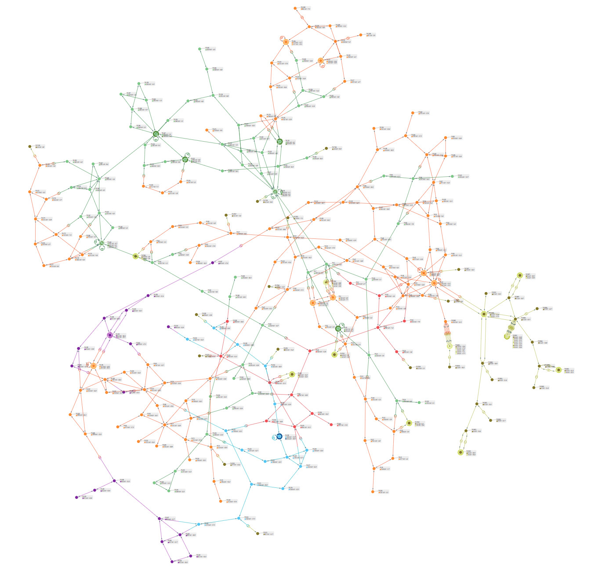

# Network Area Diagram - SVG Writing

We are showing in this guide how to create some network-area diagrams.


## Prerequisites

### Maven dependencies

First of all, we need some Maven dependencies.

- If you want to get a quick start, please add the [powsybl-starter](https://github.com/powsybl/powsybl-starter) dependency to your pom file:

```xml
<dependency>
    <groupId>com.powsybl</groupId>
    <artifactId>powsybl-starter</artifactId>
    <version>2023.3.0</version>
</dependency>
```

- If you only want to import the strictly needed dependencies for this tutorial, you can write a more detailed pom file:

<details>
<summary>Roll/unroll dependencies</summary>



<dependencyManagement>
    <dependencies>
        <dependency>
            <groupId>com.powsybl</groupId>
            <artifactId>powsybl-dependencies</artifactId>
            <version>${powsybl-dependencies.version}</version>
            <type>pom</type>
            <scope>import</scope>
        </dependency>
    </dependencies>
</dependencyManagement>

<dependencies>
    <dependency>
        <groupId>com.powsybl</groupId>
        <artifactId>powsybl-network-area-diagram</artifactId>
    </dependency>
    <dependency>
        <groupId>com.powsybl</groupId>
        <artifactId>powsybl-iidm-impl</artifactId>
    </dependency>
    <dependency>
        <groupId>com.powsybl</groupId>
        <artifactId>powsybl-ieee-cdf-converter</artifactId>
    </dependency>
    <dependency>
        <groupId>org.slf4j</groupId>
        <artifactId>slf4j-simple</artifactId>
        <version>${slf4j.version}</version>
    </dependency>
</dependencies>

<properties>
    <powsybl-dependencies.version>2023.3.0</powsybl-dependencies.version>
    <slf4j.version>1.7.22</slf4j.version>
</properties>



<div markdown="1">
Here are some details about these dependencies (see also the [powsybl artifacts documentation page](../../artifacts.md)):
- `powsybl-network-area-diagram` is the core module of network-area-diagram,
- `powsybl-iidm-impl` is used to deal with the network model,
- `powsybl-ieee-cdf-converter` is used to load the `Network` example
- `slf4j-simple` allows you to have simple logging capabilities.
</div>

</details>

## Loading the test network

We simply need to load the IEEE 300-bus example network:

```java
Network network = IeeeCdfNetworkFactory.create300();
```

## Generating the corresponding network area diagram SVG

This can be done with a single line of code:

```java
NetworkAreaDiagram.draw(network, Path.of("/tmp/diagram.svg"));
```

We end up with the following diagram:

{: width="70%" .center-image}

## Generating SVG for part of the input network

If only part of the network is wanted, we can generate a partial graph of the network, by providing
- Either a voltage level id and a depth;
- Or a list of voltage level ids and a (unique) depth.

For instance, let's generate the subgraph centered on voltage level `"VL25"` with a depth of `2`:

```java
NetworkAreaDiagram.draw(network, Path.of("/tmp/partial_diagram_25.svg"), "VL25", 2);
```

This leads to the following SVG:

{: width="70%" .center-image}

Now let's generate the subgraph with voltage levels at a maximum distance of 2 from `"VL1"` and `"VL25"`:

```java
NetworkAreaDiagram.draw(network, Path.of("/tmp/partial_diagram_1_25.svg"), List.of("VL1", "VL25"), 2);
```

This gives us the diagram below. Note that nothing ensures that the parts displayed in resulting diagram are connected.
That is, the voltage levels between two voltage levels which are connected in the full graph are not necessarily drawn.

{: width="70%" .center-image}