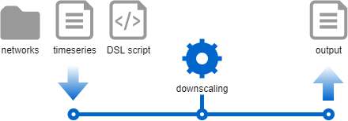

# Write the Java code to map steady state hypothesis on a network
This tutorial shows how to write Java code to perform downscaling of global data and map the results to an existing network. For instance, if you know the total amount of load consumption in a given network, downscaling allows you to find for each unitary load a new active power set point $$P0$$.

In this tutorial, we will import networks in CIM-CGMES format and map time series representing, for each network, their global active power generation set point and their global active power consumption set point. This mapping on generators and on loads will be performed using a mapping script in a DSL format. Then, we will output the results in CSV files.

## What will you build?
Input data is quite simple and is stored in three files:
- A folder containing zip archives for CIM-CGMES networks ;
- A CSV file for time series ;
- And a Groovy file for the DSL script.

These files are imported to load a set of networks, a time series store, and a DSL loader. All of these objects are then used in the downscaling process to map time series on network elements. You will also note that output generation is performed at the same time as the mapping for better performances.

{width="50%" .center-image}

## What will you need?
- About 1 hour
- A favorite text editor or IDE
- JDK 1.17 or later
- You can also import the code straight into your IDE:
    - [IntelliJ IDEA](intellij.md)

## How to complete this tutorial?
To complete this tutorial, you can either start from scratch and write the code or you can download the sources from the
[tutorial repository](https://github.com/powsybl/powsybl-tutorials) on GitHub.

## Create a new project from scratch
Create a new Maven `pom.xml` file in a directory called `downscaling` with the following content:
```xml
<?xml version="1.0" encoding="UTF-8"?>
<project xmlns="http://maven.apache.org/POM/4.0.0"
         xmlns:xsi="http://www.w3.org/2001/XMLSchema-instance"
         xsi:schemaLocation="http://maven.apache.org/POM/4.0.0 http://maven.apache.org/xsd/maven-4.0.0.xsd">
    <modelVersion>4.0.0</modelVersion>

    <parent>
        <groupId>com.powsybl</groupId>
        <artifactId>powsybl-parent</artifactId>
        <version>8</version>
        <relativePath/>
    </parent>

    <artifactId>powsybl-downscaling</artifactId>
    <name>Downscaling</name>

    <properties>
        <maven.exec.version>1.6.0</maven.exec.version>
        <slf4j.version>1.7.22</slf4j.version>
        <powsybl-dependencies.version>2025.0.2</powsybl-dependencies.version>
        <metrix.version>2.3.0</metrix.version>
    </properties>
</project>
```

## Configure the maven pom file
In the `pom.xml`, add first the following lines in the `<properties>` section to make it possible to run the future main class through Maven:
```xml
<exec.cleanupDaemonThreads>false</exec.cleanupDaemonThreads>
<exec.mainClass>powsybl.tutorials.downscaling.Downscaling</exec.mainClass>
```
When you'll have created the `Downscaling` class and its main function, you'll then be able to execute your code through:

```
$> mvn clean install exec:exec@run -Dexec.args="/tmp/"
```

Also, configure the `pom.xml` file to use a configuration file taken in the classpath, instead of the one
that is global to your system:

```xml
<build>
    <plugins>
        <plugin>
            <groupId>org.codehaus.mojo</groupId>
            <artifactId>exec-maven-plugin</artifactId>
            <configuration>
                <systemProperties>
                    <systemProperty>
                        <key>powsybl.config.dirs</key>
                        <value>${project.build.directory}/classes</value>
                    </systemProperty>
                </systemProperties>
                <classpathScope>compile</classpathScope>
            </configuration>
        </plugin>
    </plugins>
</build>
```

Now, we'll add a few required maven dependencies:

- `com.powsybl:powsybl-config-classic`: to provide a way to read the configuration
- `org.slf4j:slf4j-simple`: to provide an implementation of `slf4j`.
- `com.powsybl:powsybl-iidm-api` to work with networks.
- `powsybl-iidm-api`, `powsybl-cgmes-conversion` and `powsybl-triple-store-impl-rdf4j` to load CIM-CGMES networks.
- `powsybl-time-series-api` to work with time series.
- `powsybl-metrix-mapping` to perform downscaling.

Note: PowSyBl uses [slf4j](http://www.slf4j.org/) as a facade for various logging framework, but some APIs we use in PowSyBl use [log4j](https://logging.apache.org/log4j), which is not compatible with slf4j, making it necessary to create a bridge between the two logging system.

Add the following dependencies to the `pom.xml` file:
```xml
<dependencyManagement>
  <dependencies>
    <dependency>
      <groupId>com.powsybl</groupId>
      <artifactId>powsybl-dependencies</artifactId>
      <version>${powsybl-dependencies.version}</version>
      <type>pom</type>
      <scope>import</scope>
    </dependency>
  </dependencies>
</dependencyManagement>

<dependencies>
    <dependency>
        <groupId>com.powsybl</groupId>
        <artifactId>powsybl-config-classic</artifactId>
    </dependency>
    <dependency>
        <groupId>org.slf4j</groupId>
        <artifactId>slf4j-simple</artifactId>
        <version>${slf4j.version}</version>
    </dependency>

    <!-- Network + CGMES -->
    <dependency>
        <groupId>com.powsybl</groupId>
        <artifactId>powsybl-iidm-api</artifactId>
    </dependency>
    <dependency>
        <groupId>com.powsybl</groupId>
        <artifactId>powsybl-iidm-impl</artifactId>
    </dependency>
    <dependency>
        <groupId>com.powsybl</groupId>
        <artifactId>powsybl-cgmes-conversion</artifactId>
    </dependency>
    <dependency>
        <groupId>com.powsybl</groupId>
        <artifactId>powsybl-triple-store-impl-rdf4j</artifactId>
        <exclusions>
            <exclusion>
                <artifactId>logback-classic</artifactId>
                <groupId>ch.qos.logback</groupId>
            </exclusion>
        </exclusions>
    </dependency>

    <!-- Mapping -->
    <dependency>
        <groupId>com.powsybl</groupId>
        <artifactId>powsybl-time-series-api</artifactId>
    </dependency>
    <dependency>
        <groupId>com.powsybl</groupId>
        <artifactId>powsybl-metrix-mapping</artifactId>
        <version>${metrix.version}</version>
        <scope>compile</scope>
    </dependency>
</dependencies>
```

## Configure Metrix
We have configured this tutorial to use a locally defined `config.yml` file.
Edit the file named `config.yml` at the location `downscaling/src/main/resources`.
Start the configuration by writing:

```yaml
metrix:
  ignoreEmptyFilter: true
```
The `metrix` configuration namespace will allow you to set up mapping behavior. The `ignoreEmptyFilter` option allows continuing without crashing when a filter in the DSL script returns an empty result (more on this later).

## Import the networks from CIM-CGMES files
In this tutorial, the provided networks are in CIM-CGMES format. Each one is loaded from a zip archive containing all its related data. We provide two example archives in the `downscaling/src/main/resources/networks` directory from the tutorial repository. Both are open-source and adapted from CGMES conformity tests.

- `CGMES_smaller.zip` is based on the Small Grid Base Case Test Configuration from CGMES Conformity Assessment, where we imagine that it represents Great Britain's network. The geographical information is just needed for the mapping.
- `CGMES_bigger.zip` is based on the Real Grid Test Configuration from CGMES Conformity Assessment, where we imagine that it represents France's network. Here too, the geographical information is just needed for the mapping.

First, create `Downscaling.java` class in `downscaling/src/main/java/com/powsybl/tutorials/downscaling/`, with a main method and a logger.
Remember to specify the package: 
```java
package com.powsybl.tutorials.downscaling;
```

```java
import org.slf4j.Logger;
import org.slf4j.LoggerFactory;

public class Downscaling {

    private static final Logger LOG = LoggerFactory.getLogger(Downscaling.class);
    
    public static void main(String[] args) {
        
    }
    
    /**
     * Private constructor
     */
    private Downscaling() {}
}

```

### Prepare the networks directory
Create the `downscaling/src/main/resources/networks` directory. You must put all the CIM-CGMES archives you want to manipulate inside.

### Write network import code
Create a `Set<Network>` loaded from each zip file of the `networks` directory in the main method:

```java
Set<Network> networks = new HashSet<>();
final URL networksDir = Downscaling.class.getClassLoader().getResource("networks");
final Path networksDirPath = Paths.get(Objects.requireNonNull(networksDir).toURI());
try (Stream<Path> walk = Files.walk(networksDirPath)) {
    walk.filter(Files::isRegularFile)
    .filter(f -> f.toString().endsWith(".zip"))
    .forEach(zipFile -> {
        try {
            final Network network = Network.read(zipFile.toFile().toString());
            networks.add(network);
        } catch (Exception e) {
            String msg = "Could not load network from file [" + zipFile.getFileName().toString() + "]";
            LOG.error(msg, e);
        }
    });
}
```

Remember to add `IOException` (for the use of the `Files.walk()` method) and `URISyntaxException` (for the use of the `URL.toURI()` method) in the exception management of the main method declaration.

Since we have logged any error occurring during network import, you should be able to understand problems more easily.

## Import the time series from the CSV file
We load time series from a simple CSV file. While other, more reliable and shareable formats are supported by Powsybl, the CSV format allows you to have a direct insight into the raw data you manipulate.

The `downscaling/src/main/resources/ts-test.csv` file from the tutorial repository contains test time series data you can use to run this tutorial. You can copy it to the resources folder of your project.

In the provided time series store, we use the time series names to map them to network equipment. The time series are identified by their names (column header in the CSV file):

- Generation time series: each time series has a named composed of its country code and its energy production type. For instance, French nuclear power is referenced by the `NUCLEAR_FR` time series.
- Load time series: only one time series is needed to represent active power consumption in each country. For instance, British load consumption is referenced by `LOAD_GB` time series.

If a mapping process cannot find a time series for given equipment, the code throws an error.

### Write time series import code
In Powsybl, time series are grouped and accessed in data-structures called `TimeSeriesStore`. Create an `InMemoryTimeSeriesStore` (time series data are actually present directly in JVM memory) and populate it with the `ts-test.csv` file.

```java
InMemoryTimeSeriesStore store = new InMemoryTimeSeriesStore();
InputStreamReader isr = new InputStreamReader(Objects.requireNonNull(Downscaling.class.getClassLoader().getResourceAsStream("ts-test.csv")));
store.importTimeSeries(new BufferedReader(isr));
```

## Load mapping DSL script
Metrix integration mapping defines a DSL in groovy language that allows you to script actions that will be executed during Metrix execution. Please refer to [mapping DSL documentation](inv:powsyblmetrix:*:*#mapping) for further information.

A `TimeSeriesDslLoader` data structure needs to be built to load the DSL script:

```java
final Path mappingFilePath = Paths.get(Objects.requireNonNull(Downscaling.class.getClassLoader().getResource("mapping.groovy")).toURI());
TimeSeriesDslLoader dslLoader;
try (Reader reader = Files.newBufferedReader(mappingFilePath)) {
    dslLoader = new TimeSeriesDslLoader(reader, mappingFilePath.getFileName().toString());
}
```

### A look at the DSL loading script
The DSL loading script is in groovy format. It will be executed by the mapping operation, and its content defines what will be actually done.

On top of groovy language, Metrix integration defines a Domain-Specific Language (or DSL) that allows you to quickly define operations relative to network's mapping. The script is run once per network, here is its content script explained:

```groovy
import com.powsybl.iidm.network.EnergySource

// Retrieve the current network country
country = network.getCountries().iterator()[0]

// Iterate over all possible energy sources
for (eSource in EnergySource.values()) {
    // Run the mapToGenerators function : allows to visit all generators
    // and to define the specifics of the mapping operation to perform
    mapToGenerators {
        timeSeriesName eSource.toString() + '_' + country.toString() // name of the time series to map
        distributionKey { 
            generator.maxP // Distribution key : what value should be used to ponderate the global value repartition on generators
        }
        filter {
            generator.energySource == eSource // Filter : only map on selected generators
        }
    }
}

// Run the mapToLoads function : allows to visit all loads
mapToLoads {
    timeSeriesName 'LOAD_' + country.toString()
    distributionKey {
        load.p0
    }
}

```

## Perform mapping on each network
Next, we iterate over each network to map the matching time series on its generators and loads. The code is called into the following loop:

```java
for (final Network network : networks) {
    // ...
}
```

### Prepare time series to be mapped
We make the hypothesis that each network expands on one and only one country. Using this information in the network API, we can prepare the names of all the time series in the storer used for the mapping.

```java
Country country = network.getCountries().iterator().next();
Set<String> tsNames = new HashSet<>();
network.getGeneratorStream()
       .map(Generator::getEnergySource)
       .distinct()
       .forEach(eSource -> tsNames.add(eSource.toString() + "_" + country.toString()));
tsNames.add("LOAD_" + country.toString());

```

### Prepare mapping parameters
Metrix integration mapping is highly parameterizable. Prepare inputs for the mapping execution:

```java
final MappingParameters mappingParameters = MappingParameters.load();
final ComputationRange computationRange = new ComputationRange(store.getTimeSeriesDataVersions(), 1, 1);
final TimeSeriesMappingConfig mappingConfig = dslLoader.load(network, mappingParameters, store, new DataTableStore(), computationRange);
mappingConfig.setMappedTimeSeriesNames(tsNames);

// Initialize mapping parameters
final TimeSeriesMappingConfigTableLoader loader = new TimeSeriesMappingConfigTableLoader(mappingConfig, store);
final Range<Integer> pointRange = Range.closed(0, loader.checkIndexUnicity().getPointCount() - 1);
final TimeSeriesMapperParameters tsMappingParams = new TimeSeriesMapperParameters(
        new TreeSet<>(store.getTimeSeriesDataVersions()),
        pointRange,
        true,
        true,
        false,
        mappingParameters.getToleranceThreshold()
);
```
- The Computation range defines all the versions of the time series that need to be mapped. In this tutorial, we only handle `single-versioned` time series.
- Point range defines the number of time steps that need to be mapped. Here, we use the whole horizon for all time series (provided time series have the same horizon). 
- Mapping parameters object allows loading general mapping behavior parameters, from the `config.yml` file. 

### Prepare outputs
We would like to export output CSV files to an output directory. In this tutorial, we define an output path as configurable by the main method caller (in main args).

```java
final Path outputPath = Paths.get(args[0]);
```

Each network downscaling produces an output file and a log file, stored in a separate directory named after the network's country.

```java
final Path networkOutputDir = outputPath.resolve(country.getName());
Files.createDirectories(networkOutputDir);
```

### Mapping observers
Performing mapping requires visiting all network equipment.  Actually, this operation can be costly in processor time, and we prefer to perform it as little as possible. A naive approach would do the following steps:

- Visit each equipment to map values on it.
- Visit each equipment again to output the mapped value.

Metrix integration mapping allows for a far better strategy, using the Observer pattern. In the mapping process, observers execute custom code each time equipment gets visited. This way, network is visited only once, and all useful operations are performed at the same time.

Here, we use an `EquipmentTimeSeriesObserver`: writes a new line in a CSV output file each time equipment is mapped. Note that each time series version is mapped independently: an output file for each version (named `<version_name>.csv`) is created. In our case, only a `version_1.csv` file is produced for each country.
We will export to a XIIDM file in the country output directory the networks associated to each time series and each version. Both equipment values export and network export will be performed at the same time.
The `TimeSeriesMappingLogger` object will create a `mapping.log` file for each country that groups the mapping logs.

```java
final TimeSeriesMapperObserver equipmentWriter = new EquipmentTimeSeriesWriterObserver(network, mappingConfig, 10, pointRange, networkOutputDir);
final DataSource dataSource = DataSourceUtil.createDataSource(networkOutputDir, "network", null, null);
final TimeSeriesMapperObserver networkPointWriter = new NetworkPointWriter(network, dataSource);
final List<TimeSeriesMapperObserver> observers = List.of(equipmentWriter, networkPointWriter);
TimeSeriesMappingLogger logger = new TimeSeriesMappingLogger();
```

### Execute mapping
Prepare mapping logs and perform actual mapping with a simple call:

```java
TimeSeriesMapper mapper = new TimeSeriesMapper(mappingConfig, tsMappingParams, network, logger);
mapper.mapToNetwork(store, observers);
logger.writeCsv(networkOutputDir.resolve("mapping.log"));
```

## Summary
We have learnt how to write Java and Groovy code to run a mapping in a downscaling context. We've shown how to load network files in CIM-CGMES format, how to load local CSV time series files, and how to define a mapping DSL script. We have defined what are mapping observers and how to use them to output mapping results in files.

## Going further
Learn more about [Metrix simulator](inv:powsyblmetrix:*:*#index).