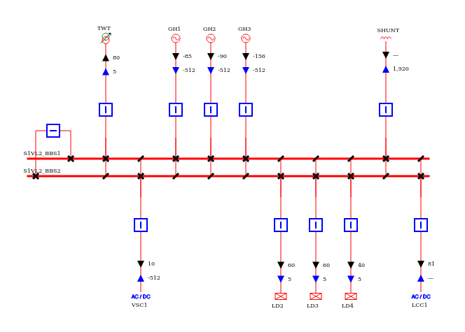
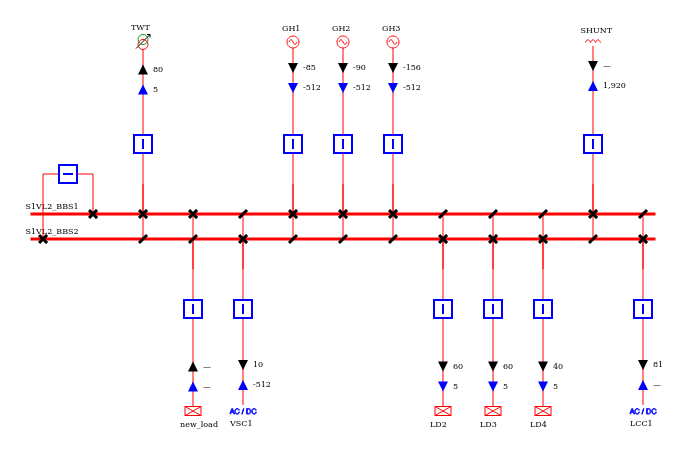
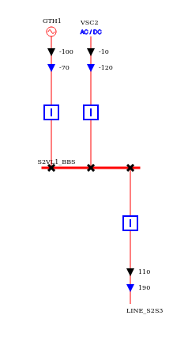
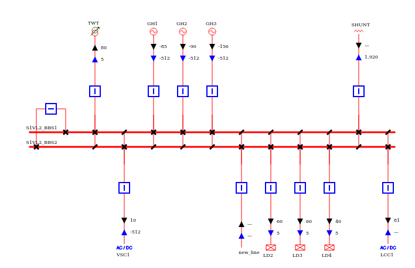
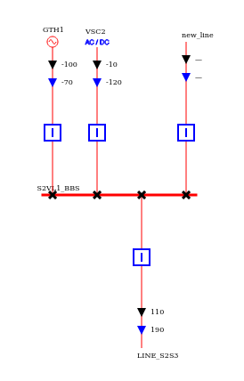
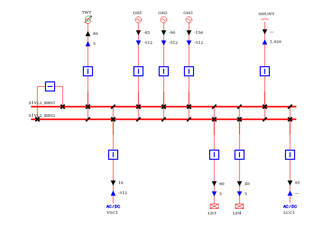

# Tutorial on how to use network modification methods in Groovy

This documentation refers to the tutorial 'groovy-modifications' available [here](https://github.com/powsybl/powsybl-tutorials/tree/main/groovy-modifications).

In this tutorial, you will find three scripts explaining how to add a load and a line with the associated topology to a network and how to remove a load.

The network element is added to the network and the switches are also created to connect the element
to a given busbar section with a closed disconnector and a breaker. Open switches are also added to every parallel busbar sections.
When removing an element, the element itself is removed as well as the associated breakers and disconnectors.

Other similar functions are available to add every kind of injections and branches.

NB: The design of these scripts is not groovy-friendly. The methods will be wrapped later.

# CreateLoadBay.groovy

In this script, a node/breaker network is first loaded. Then a load is added on the busbar section BBS1 of the voltage level named S1VL2 and the network is exported.

Before adding the load, the voltage level S1VL2 is:

The script adds the load between the transformer TWT (order position 10) and the VSC converter station VSC1 (order position 20). For that, the order position is set to 15 when adding the load.
It is also possible to specify the direction of the load. By default, it is directed to the bottom.

The voltage level S1VL2 will look like that after applying the modification:

It is possible to create a builder with any kind of injection adder and thus create any type of injection.

Here are the options that must/can be filled:

| Parameter              | Mandatory | Default value       | Description                                                                                                                                                                       |
|------------------------|-----------|---------------------|-----------------------------------------------------------------------------------------------------------------------------------------------------------------------------------|
| InjectionAdder         | yes       | /                   | The adder corresponding to the injection to be added.  Should be created beforehand and contain all the required information.                                                 |
| BusOrBusbarSectionId   | yes       | /                   | The ID of the busbar (node/breaker network) or of the bus (bus/breaker network) on which the injection should be connected.                                                       |
| InjectionPositionOrder | yes       | /                   | Required in Node/Breaker. The order position of the injection to create the corresponding extension.   The injection will be positioned accordingly on the busbar section.    |
| InjectionFeederName    | no        | Id of the injection | Only in Node/Breaker. An optional name to be put in the ConnectablePosition extension and that will be displayed on the diagrams.                                                 |
| InjectionDirection     | no        | BOTTOM              | Only in Node/Breaker. An optional direction to be put in the ConnectablePosition extension and that will correspond to the direction of the injection in the single-line-diagram. |

# CreateLineBay.groovy

In this script, the same node/breaker network is loaded and a line is created between two voltage levels S1VL2 and S2VL1.

Before adding the line, the two voltage levels are:

The script is adding the line between the generator GH3 (order position 50) and the load LD2 (order position 60) on S1VL2 and on the right of the line LINE_S2S3 (order position 30) on S2VL1.
The order position for the new line in the script are taken to be between 50 and 60 on S1VL2 and higher than 30 on S2VL1.
On S1VL2, the new line is pointing to the bottom, which is specified in the modification via the parameter ConnectablePosition.BOTTOM.
On S2VL1, the direction of the new line is TOP.

The voltage levels will then look like that after adding the line:

The same method can be used to create a two-windings transformer on a network.

Here are the options that must/can be filled:

| Parameter             | Mandatory | Default value    | Description                                                                                                                                                                                                               |
|-----------------------|-----------|------------------|---------------------------------------------------------------------------------------------------------------------------------------------------------------------------------------------------------------------------|
| BranchAdder           | yes       | /                | The adder corresponding to the branch to be added.  Should be created beforehand and contain all the required information.                                                                                            |
| BusOrBusbarSectionId1 | yes       | /                | The ID of the busbar (node/breaker network) or of the bus (bus/breaker network) on which the branch should be connected on side 1.                                                                                        |
| BusOrBusbarSectionId2 | yes       | /                | The ID of the busbar (node/breaker network) or of the bus (bus/breaker network) on which the branch should be connected on side 1.                                                                                        |
| PositionOrder1        | yes       | /                | Required in Node/Breaker. The order position of the branch on side 1 to create the corresponding extension.   The branch will be positioned accordingly on the busbar section 1.                                      |
| PositionOrder2        | yes       | /                | Required in Node/Breaker. The order position of the branch on side 2 to create the corresponding extension.   The branch will be positioned accordingly on the busbar section 2.                                      |
| FeederName1           | no        | Id of the branch | Only in Node/Breaker. An optional name to be put in the ConnectablePosition extension for the side 1 and that will be displayed on the diagrams.                                                                          |
| FeederName2           | no        | Id of the branch | Only in Node/Breaker. An optional name to be put in the ConnectablePosition extension for the side 1 and that will be displayed on the diagrams.                                                                          |
| Direction1            | no        | TOP              | Only in Node/Breaker. An optional direction for the side 1 of the branch to be put in the ConnectablePosition extension and that will correspond to the direction of the side 1 of the branch in the single-line-diagram. |
| Direction2            | no        | TOP              | Only in Node/Breaker. An optional direction for the side 1 of the branch to be put in the ConnectablePosition extension and that will correspond to the direction of the side 1 of the branch in the single-line-diagram. |

# RemoveLoaBay.groovy

In this script, a load is removed from the initial node/breaker network.
The load with id LD2 is removed from the voltage level S1VL2.

Before removing the load, the voltage level is:

After the modification:

In this method, the only parameter to give is the id of the connectable that we want to remove. It works for injections as well as branches. In this case, the branch and its topology are removed on both sides.

The parameter that must be fill is:

| Parameter     | Default value    | Description                                                           |
|---------------|------------------|-----------------------------------------------------------------------|
| ConnectableId | /                | The ID of the connectable to be removed (cannot be a busbar section). |
