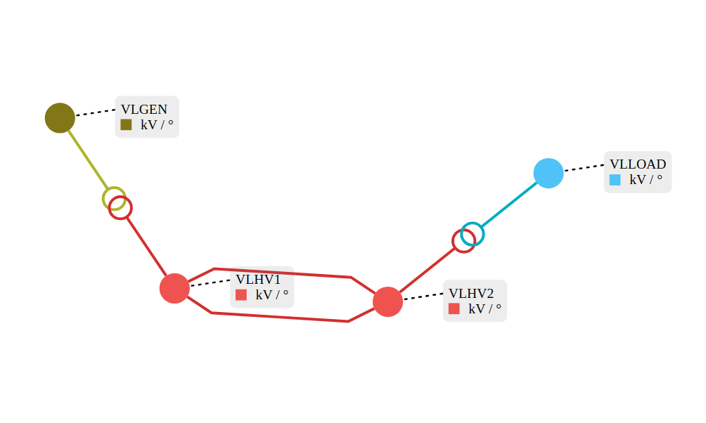

# Write the Java code to perform security analysis

In order to perform a `security analysis`, you need a `network` and at least one `contingency` (i.e. one failure) on that network,
and possibly `operator strategies` that can take `actions` to correct a default.

### What will you build?

This tutorial presents three use cases of security analysis simulation. 
Each example follows a brief and straightforward workflow, using input data that includes an XIIDM file and at least one contingency.

> The three workflows can be summarized as follows:
```text
Network + contingency                       --> Security Analysis 
Network + contingency + operators strategy  --> Security Analysis 
Network + contingency + limit reduction     --> Security Analysis 
Network + contingency + state monitor       --> Security Analysis 
```


#### Tutorial steps

Loading the network is a common step for all workflows. Then:

1. Define a contingency and run the security analysis. 
2. Add operator strategies and reference the associated actions. 
3. Configure limit reduction parameters.
4. Add state monitor parameters.

### Import the network from an XML IIDM file

The network we use here is available in the tutorial's resources and is described in the IIDM format. 
Start by adding the following lines in the main function of the tutorial:

```java
Network network = Network.read("network.xiidm", SecurityAnalysisTutorials.class.getResourceAsStream("/network.xiidm"));
```
We now have a network in memory.

The following are shown in the (Network Area Diagram) below.
- 4 `voltage levels`
- There is one `generator` in the voltage levels `VLGEN`.
- There is one `load` on the voltage levels `VLLOAD`.
- The voltage levels `VLHV1` and `VLHV2` they are connected by two parallel lines.

{width="75%" .center-image}

### Create a contingency

Before creating a contingency, make sure that contingency can actually cause a network violation.
As an example, we will add a limit to the line `NHV1_NHV2_1` to simulate a default violation.

```java
network.getLine("NHV1_NHV2_1")
        .getOrCreateSelectedOperationalLimitsGroup1("DEFAULT")
        .newCurrentLimits()
        .setPermanentLimit(460)
        .add();
network.getLine("NHV1_NHV2_1").setSelectedOperationalLimitsGroup1("DEFAULT");
```

Next, on the other line `NHV1_NHV2_2`, we can add a contingency. 

```java
Contingency contingency = Contingency.line("NHV1_NHV2_2");
```

Now the security-analysis inputs are prepared, 
we can run a security analysis. This is done in the following way.
```java
SecurityAnalysis.run(network, List.of(contingency));
```
Here are the corresponding prints in the tutorial:

````
:: SecurityAnalysis :: network and contingency
Pre contingency results
Post contingency results
    Contingency : NHV1_NHV2_2
	 	  Violation Value: 1008.9287882269946 MW/°
	 	  Violation Limit: 460.0 MW/°
Operator strategy results
````

### Create an Operator Strategy with Actions

```java
LoadAction loadAction = new LoadActionBuilder()
        .withId("loadActionId")
        .withLoadId("LOAD")
        .withActivePowerValue(300)
        .withRelativeValue(false)
        .build();
GeneratorAction generatorAction = new GeneratorActionBuilder()
        .withId("generatorActionId")
        .withGeneratorId("GEN")
        .withActivePowerValue(300)
        .withActivePowerRelativeValue(false)
        .build();

OperatorStrategy operatorStrategy = new OperatorStrategy("id1", ContingencyContext.specificContingency(contingency.getId()),
        List.of(new ConditionalActions("stage1", new TrueCondition(), List.of(loadAction.getId(), generatorAction.getId()))));

SecurityAnalysisRunParameters parameters = new SecurityAnalysisRunParameters();
parameters.addOperatorStrategy(operatorStrategy);
parameters.addAction(loadAction);
parameters.addAction(generatorAction);

// Run security analysis
SecurityAnalysis.run(network, List.of(contingency), parameters);
```

Here are the corresponding prints in the tutorial:
````
:: SecurityAnalysis :: network, contingency, operator strategies and actions
Pre contingency results
Post contingency results
    Contingency : NHV1_NHV2_2
	 	  Violation Value: 1008.9287882269946 MW/°
	 	  Violation Limit: 460.0 MW/°
Operator strategy results
    OperatorStrategy : id1
        Violation Value: 516.0706108379493 MW/°
        Violation Limit: 460.0 MW/°
````

### Create a Limit Reduction

Note that the reduction affect results as pre-contingency violations.

As an example, we are going to reduce the current limit of `NHV1_NHV2_1` line by 10%.

```java
// Limit Reduction
LimitReduction limitReduction = LimitReduction.builder(LimitType.CURRENT, 0.9)
        .withMonitoringOnly(false)
        .withContingencyContext(ContingencyContext.all())
        .build();
parameters.addLimitReduction(limitReduction);

// Run security analysis
SecurityAnalysis.run(network, List.of(contingency), parameters);
```

Here are the corresponding prints in the tutorial:

````
:: SecurityAnalysis :: network, contingency and limit reduction
Pre contingency results
    Value: 456.7689759899928 MW/°
    Limit: 460.0 MW/°
Post contingency results
    Contingency : NHV1_NHV2_2
        Violation Value: 1008.9287882269946 MW/°
        Violation Limit: 460.0 MW/°
Operator strategy results
````

### Create a state Monitor

A state Monitor provides information about the state of elements of the network such as branch, bus and three-winding transformers

As an example, we are going to add state monitor parameter, we will add branch and voltage levels ids that we want information about.

```java

Contingency contingency = Contingency.line("NHV1_NHV2_2");
SecurityAnalysisRunParameters parameters = new SecurityAnalysisRunParameters();
// State Monitor
StateMonitor stateMonitor = new StateMonitor(new ContingencyContext(contingency.getId(), SPECIFIC),
        Set.of("NHV1_NHV2_1"), // <= branch id
        Set.of("VLGEN", "VLHV1", "VLHV2", "VLLOAD"), // <= Voltage Levels id
        Set.of());
parameters.addMonitor(stateMonitor);

// Run security analysis
SecurityAnalysis.run(network, List.of(contingency), parameters);
```

Here are the corresponding prints in the tutorial:
````
:: SecurityAnalysis :: network, contingency and state Monitor
Pre contingency results
Post contingency results
        Contingency : NHV1_NHV2_2
        branchResult: BranchResult{branchId='NHV1_NHV2_1', p1=610.56215354332, q1=334.0562715296571, i1=1008.9287882269946, p2=-600.9961559564288, q2=-285.3791465506596, i2=1047.8257691455576, flowTransfer=NaN}
        busResult: BusResults{voltageLevelId='VLGEN', busId='NGEN', v=24.5, angle=2.3579552596552684}
        busResult: BusResults{voltageLevelId='VLHV1', busId='NHV1', v=398.26472467308224, angle=0.0}
        busResult: BusResults{voltageLevelId='VLHV2', busId='NHV2', v=366.58481145130054, angle=-7.499211315976122}
        busResult: BusResults{voltageLevelId='VLLOAD', busId='NLOAD', v=137.74213838955504, angle=-14.464666247602445}
Operator strategy results
````