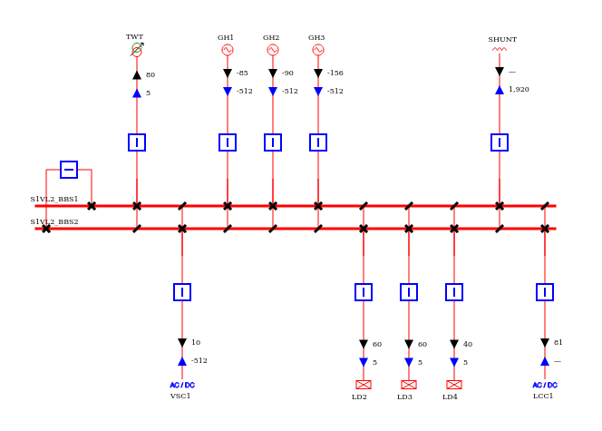
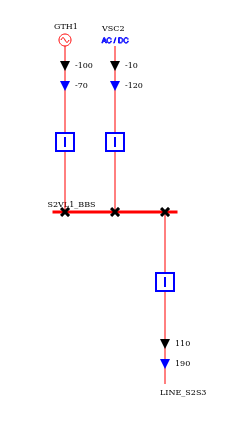
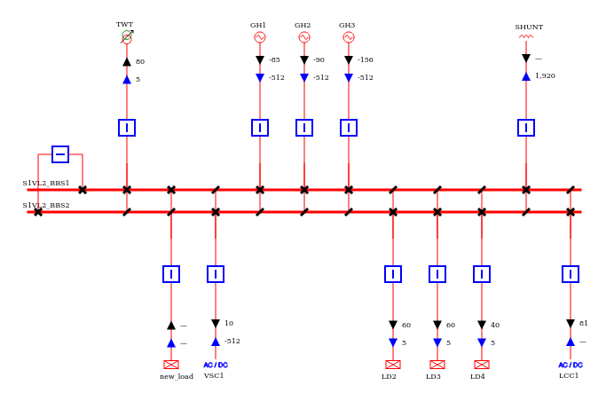
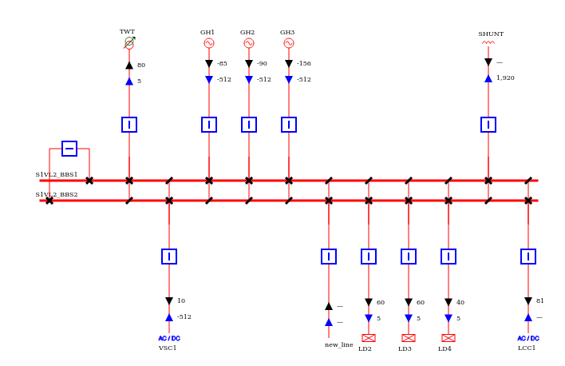
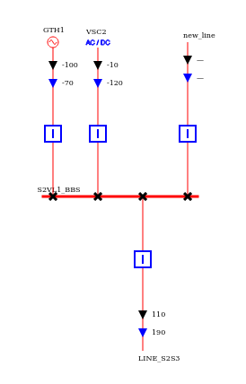

# Tutorial on how to use network modifications methods in Groovy

In this tutorial, you will find two scripts explaining how to add a load and a line with the topology to a network.

The network element is added to the network and the switches are also created to connect the element 
to a given busbar section with a closed disconnector. Open switches are also added to every parallel busbar sections.

Other similar functions are available to add every kind of injections and branches.

On all the scripts, a node/breaker is imported. The single line diagram of voltage levels S1VL2 and S2VL1 of this network are:

# CreateLoadBay.groovy
In this script, a node/breaker network is first loaded. Then a load is added on the busbar section BBS1 of the voltage level named S1VL2 and the network is exported.
It is possible to create a builder with any kind of injection adder and thus create any type of injection.

The voltage level S1VL2 will look like that after the modification:

# CreateLineBay.groovy
In this script, the same node/breaker network is loaded and a line is created between two voltage levels S1VL2 and S2VL1.
The same method can be used to create a two-windings transformer on a network.

The voltage levels will then look like that after adding the line:

