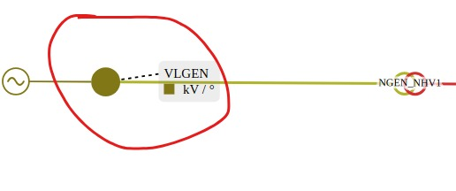

# Loadflow validation tutorial

The tutorial validates the load flow before and after running a load flow.

PowSyBl provides the following load flow validation types:
- `BUSES`
- `FLOWS`
- `GENERATORS`
- `SVCS`: static var compensator
- `SHUNTS`: shunt compensator
- `TWTS`: two-winding transformer
- `TWTS3W`: three-winding transformer

### Example 
Network overview



#### Bus validation
Bus validation checks Kirchhoff's power balance equations
```text
// At each bus checks active and reactive power balance :
|incomingP + loadP| <= threshold
|incomingQ + loadQ| <= threshold
```
If we consider the bus connecting generator `GEN` to the two-winding transformer `NGEN_NHV1`, its calculated bus identifier is `VLGEN_0`



Before running the load flow, the CSV formatter displays terminal powers missing values as `NOT_CALCULATED`:
```text
VLGEN_0;incomingP;NOT_CALCULATED
VLGEN_0;incomingQ;NOT_CALCULATED
```
After the load flow, the generator bus contains the following active power values:

```text
Generator terminal P:    -605.5595954348781 MW
Transformer terminal P:  +605.5595848046546 MW
```
The resulting active power balance is:
```text
incomingP = generatorP + transformerP
          = -605.5595954348781 + 605.5595848046546
          = -1.06302235e-05 MW
```
The CSV formatter result:
```text
VLGEN_0;incomingP;-1.06302e-05
VLGEN_0;incomingQ;0.00000
```
Since no load is connected directly to this bus:

```text
loadP = 0 MW
```
A non-zero validation threshold is required to accept such numerical residuals:
```yaml
loadflow-validation:
  threshold: 0.01
```