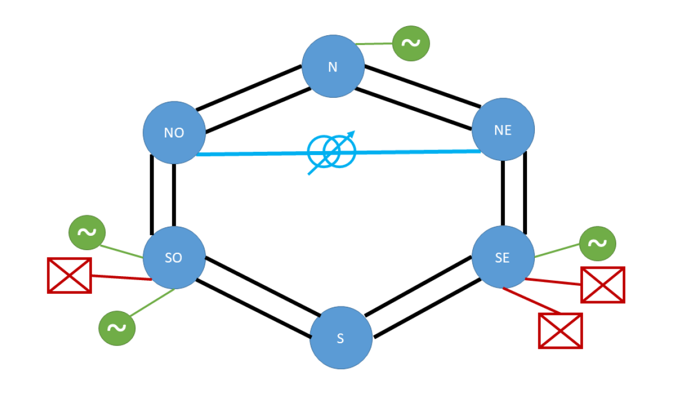
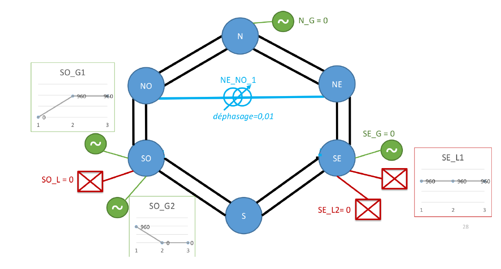
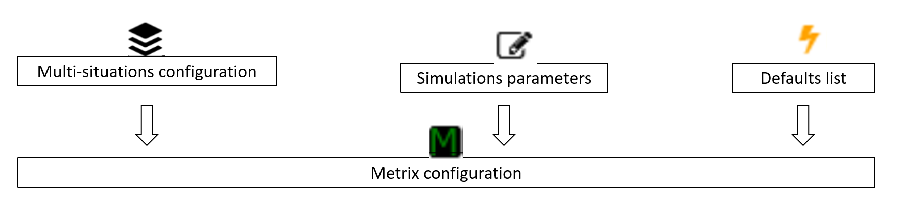
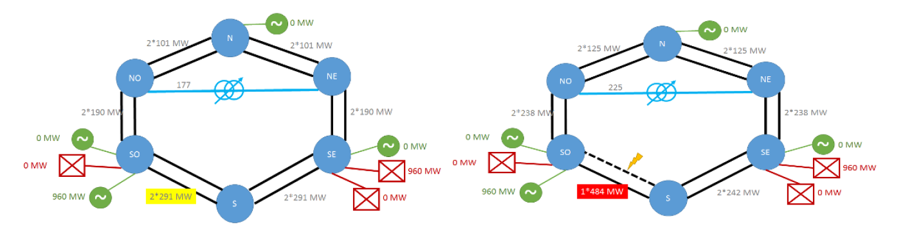

# Powsybl-METRIX tutorial
author:
- RTE
  title: "**Metrix tutorial - 6 node network**"
---

**Objectives of the practical work:** On a very simple network (6 substations), learn how to use
PowSyBl-Metrix settings and outputs, and how to explain the
obtained results.

## What do you need ?
- About 4 hours
- A UNIX environment
- git (to be able to clone the repository)
- ...and that's it.

## How to install metrix
In this chapter we will install Powsybl-METRIX on your environment. You can skip this part if Powsybl-METRIX is already set up.
1. **Clone the repository**: open a terminal in the directory of your choice, and enter the following command line:
   <code> git clone https://github.com/powsybl/powsybl-metrix.git </code>
2. **Install Metrix**: go in the cloned repository directory, and run the script `./install.sh`.
   When you are asked if you want a full or a metrix installation, select "full". When you are asked if you want to add Powsybl-metrix to the path, select "yes".

## 1- Network presentation

The network used for this practicals consists of 6 substations, all connected
by two parallel lines with the same electrotechnical characteristics
(same resistance and same reactance for each line), as well as two
HVDC lines and a Phase-Shifter Transformer (PST). It also features 4 groups and three loads.\

The network is described in a file in the "IIDM" format (the native Powsybl network representation format).
It can be found in the folder `src/main/resources/3A/data/reseau_6noeuds.xiidm`.

In this practicals, each station and line's name refers to cardinal points:
- NO: North West
- N: North
- NE: North East
- SE: South East
- S: South
- SO: South West

# 2- To get started:
Along with the network file, you can find a timeseries file at the path:
`src/main/resources/3A/data/ts/time-series-tp.csv`. It will contains time series to map to each demand and/or 
unavoidable production of the network. It is organized as follows:

| Ts    | Version | SE_L1 | SO_G1 | SO_G2 | seuilN | seuilAM |
|-------|---------|-------|-------|-------|--------|---------|
| T01   | 1       | 960   | 0     | 960   | 400    | 480     |
| T02   | 1       | 960   | 960   | 0     | 400    | 480     |
| T03   | 1       | 960   | 960   | 0     | 100    | 480     |

Note: These two files (network file and timeseries file) are used throughout all exercises of the tutorial.

In mapping output, you should have the following network:\

# 3- Load Flow mode: Understanding flows

In load flow mode, Metrix computes active flows on all network elements in N and N-1 based on network
information (topology, and electrotechnical characteristics), production and load timeseries and a list of contingencies.
It does not optimize anything. The following figure summarizes the inputs and outputs of this Mode:

The multi-situation contains the network information and the timeseries. The Metrix configuration script is a script 
that allows to hold all parameters and options of the simulation (in particular the calculation mode, the
modeling choices, and the wanted output data). The contingencies script denotes the list of defects and the 
options related to them.

### Action 3A - Run in simple LF mode

#### Goal:

We want to observe the flows on all the network elements in the base case (N) and when line S_SO_S1 is removed (N-1).

#### In practice

- Create a Metrix configuration script in which we declare
  that we want results on all the network elements of the network:

Metrix configuration script: (conf.groovy)

    for (l in network. branches) {
       branch(l.id) {
         baseCaseFlowResults true
         maxThreatFlowResults true
       }
    }

- Create a list of contingencies containing only the N-1 on the work
  S_SO_1:

Contingencies script: (contingencies.groovy)

    contingency('S_SO_1') { equipments 'S_SO_1'}

- Run the calculation and note the flows on the structures on the different time steps.

#### Results and Analysis:

You must obtain the following result maps: flow map
in N on the left and in N-1 on the right.

More specifically, on the S_SO_2 line in N and N-1 on the various
time steps, the following results are obtained:\

| Ts    | FLOW_S\_SO_2 | MAX_THREAT_1\_FLOW_S\_SO_1 | MAX_THREAT_1\_FLOW_S\_SO_2 |
|-------|--------------|----------------------------|----------------------------|
| T01   | -290.5       | -484.2                     | S_SO_1                     |
| T02   | -290.5       | -484.2                     | S_SO_1                     |
| T03   | -290.5       | -484.2                     | S_SO_1                     |

In the base case (N), as the generation units and the consumptions are located at the south, the
network is less impedant and we see that the flows pass mostly through it. There is also flow on the PST, and to the north. The
flows are the same on the 3 time steps because the only difference
is that production moves from the SO_G2 group to S0_G1 group which are on
the same substation.

### Action 3B - Monitor S_SO_2

#### Goal:

We want to monitor some network elements (here S_SO_2), i.e.:
- in load flow mode, flows and violations are reported only for the monitored elements. This reduces the amount of results to
analyze.
- in optimization mode (see below), only the maximum flows constraints of these monitored elements are taken into account. This reduces the computation time.

#### In practice

- Modify the Metrix configuration script to monitor the structure
  S_SO_2 in N and on contingenciess.

Metrix configuration script: (conf.groovy)

    branch('S_SO_2') {
       baseCaseFlowResults true // results in N
       maxThreatFlowResults true // results on N-k
       branchRatingsBaseCase 'thresholdN' // threshold in N
       branchRatingsOnContingency 'thresholdN' // threshold in N-k
    }

- Run the calculation and analyze the new results.

#### Results and Analysis:

You need to ask for new columns in the output file
OVERLOAD\_ BASECASE (Difference between the flow in N
and the maximum allowed flow in the base case) and OVERLOAD_OUTAGES (Difference between the flow in N-1 and the maximum allowed flow after contingency).

| Ts    | OVERLOAD_BASECASE | OVERLOAD_OUTAGES |   
|-------|-------------------|------------------|
| T01   | 0                 | 84.2             | 
| T02   | 0                 | 84.2             | 
| T03   | 190.5             | 384.2            | 

There is no constraint violation in N on the first two time steps then that there are on the third. This is due to the change in the value of the threshold from 400 to 100 MW in the 'thresholdN' timeseries. There are overloads on all time steps in N-1.

## 4- OPF mode without redispatching

In this mode, Metrix is allowed to use topological parades in oorder to minimize the violation of line capacities. However, it does not change the dispatch: production and consumption at each node cannot be modified.

### Action 4A - Use topological countermeasures to solve constraints

#### Goal:

We would like to know if the dispatcher's remedial actions are enough to address the previously observed constraint violations. For this, we first want the use of topological parades. In this
case, which topological parades (opening of line or splitting a substation into 2 electrical nodes) could be effective?

#### In practice:

- In the \"Metrix simulation\" object, define the following 4 remedial actions on the S_SO_1 contingency
    - opening of the circuit breaker SS1_SS1_DJ_OMN (this goes to two nodes
      post S)

    - opening of circuit breaker SOO1_SOO1_DJ_OMN (this goes to two
      nodes the post of SO)

    - opening of the two circuit breakers above

    - opening of the S_SO_2 line

Parade file: (parades.csv)

    NB;4;
    S_SO_1;1;SS1_SS1_DJ_OMN;
    S_SO_1;1;SOO1_SOO1_DJ_OMN;
    S_SO_1;2;SS1_SS1_DJ_OMN;SOO1_SOO1_DJ_OMN;
    S_SO_1;1;S_SO_2;

- Configure the Metrix script as shown below :

Metrix configuration file (conf.groovy)

    parameters {computationType OPF_WITHOUT_REDISPATCHING}

    branch('S_SO_2') {
       baseCaseFlowResults true // results in N
       maxThreatFlowResults true // results on N-k
       branchRatingsBaseCase 'thresholdN' // threshold in N
       branchRatingsOnContingency 'thresholdN' // threshold in N-k
    }

-  Run Metrix and observe the activations of parades at the different time steps as well as  the evolution of the constraints (cf description of the Metrix results) .

#### Results and Analysis:

On the first time step, Metrix moves the SO substation to two nodes, this
which \"extends the path\" passing through the constrained structure and allows
remove the constraint completely.

On time steps 2 and 3, this parry does not work because the
production is on the other node of the SO post. Metrix then chooses the
parade which consists in opening the work in constraint. He had not
retained this parry on the first time step because it was declared in
list of parades: with identical effectiveness, the parades
are chosen in the order of the list.

On the 3rd time step, the constraint in N remains unchanged.

### Action 4B - Use a phase-shifting transformer

#### Goal:

Now we want to check if the use of the phase-shifting transformer by itself is enough to solve the constraints. We can ask Metrix to optimize the phase shifts of the PST, both preventively and on certain contingencies. What sign of phase shift would relieve the N and N-K constraints identified? Positive which slows down the flow between NO and NE or negative which accentuates the flow between NO and NE?

#### In practice:

In the Metrix configuration file:

- authorize the PST NE_NO_1 to move preventively and on the contingency
  S_SO_1 (see syntax).

Metrix configuration file:

  parameters {
      computationType OPF_WITHOUT_REDISPATCHING
  }

  branch('S_SO_2') {
      baseCaseFlowResults true // results in N
      maxThreatFlowResults true // results on N-k
      branchRatingsBaseCase 'thresholdN' // threshold in N
      branchRatingsOnContingency 'thresholdN' // threshold in N-k
  }

  phaseShifter('NE_NO_1') {
    controlType OPTIMIZED_ANGLE_CONTROL
    onContingency 'S_SO_1'
  }

- Run the calculation without parades

- Observe the actions on the PST and the evolution of the constraints (cf
  description of Metrix results).

For the rest of the tutorial, we will no longer use the PST, remember to remove it from the Metrix configuration for the next steps.

#### Results and Analysis:

After running the OPF_WITHOUT_REDISPATCHING calculation without parade, we observe that Metrix plays on the phase shift of the PST in curative on all the steps of time and preventively on the third time step. Constraints
are fully lifted:\

| Results                     | T01   | T02   | T03   | 
|:----------------------------|-------|-------|-------|
| PST_CUR_NE_NO_1\_S_SO_1     | -0.19 | -0.19 | -1.05 | 
| PST_NE_NO_1                 | 0.01  | 0.01  | -1.05 | 
| PST_CUR_TAP_NE_NO_1\_S_SO_1 | 1     | 1     | 1     | 
| PST_TAP_NE_NO_1             | 17    | 17    | 1     |
| OVERLOAD_BASECASE           | 0     | 0     | 0     |
| OVERLOAD_OUTAGES            | 0     | 0     | 220   |

## 5- OPF mode: Optimize all actions

### Action 5A - Configure adjustable groups in preventive

#### Goal:

The goal here is to take care of the residual violations remaining after the "free" actions that are constituted by the parades (it is assumed that the PST is not available/does not exist). As we have seen in part 4A, the parades had not been enough to respect the constraints in preventive mode. Hence we would like to check if the preventing redispatch allows to address these constraints violations. What level of redispatch should we expect?

#### In practice:

- Define in the Metrix configuration file that all dispatchable production can move in preventive with costs upwards of 100 and at decreasing by 1:

Metrix configuration file:

    parameters {computationType OPF}

    branch('S_SO_2') {
       baseCaseFlowResults true // results in N
       maxThreatFlowResults true // results on N-k
       branchRatingsBaseCase 'thresholdN' // threshold in N
       branchRatingsOnContingency 'thresholdN' // threshold in N-k
    }

    for (g in ['SO_G1','SE_G','SO_G2','N_G']) {
     generator(g) {
       redispatchingDownCosts 1
       redispatchingUpCosts 100
     }
    }

- Change simulation mode to \"OPF\", resume parades, and run the calculation

- Observe the actions taken by Metrix and the associated cost of redispatching

NB: the SE_G group has a Pmax of 600MW.

#### Results and Analysis:

By running the OPF calculation with the previous parades and the groups in preventive, we can clearly see that Metrix uses the parades in priority in curative mode, which is enough to solve the constraints in N-k. Concerning the violations in N observed in Chapter 4C, Metrix has to perform preventive redispatch, since parades cannot perform in N. We can observe redispatch on the 3rd time step; Metrix chooses to lower the generating unit on SO, increase the one on SE up to its Pmax, and complete it with a slight increase of the production on node N. The cost of redispatching is equal to the required volumes multiplied by their costs.

At last there are no more constraint violation (as it is always the case in OPF mode) and the flow on the monitored structure is reduced to exactly 100MW in N on the 3rd time step.

| Result            | T01 | T02 | T03     | 
|:------------------|-----|-----|---------|
| OVERLOAD_BASECASE | 0   | 0   | 0       | 
| OVERLOAD_OUTAGES  | 0   | 0   | 0       | 
| GEN_COST          | 0   | 0   | 78470.4 | 
| GEN_SO_G1         | /   | /   | -776.9  |
| GEN_SE_G          | /   | /   | 600     |
| GEN_N\_G          | /   | /   | 176.9   |

### Action 5B - Configure adjustable groups in curative

#### Goal:

The goal here is to see how curative redispatching operates in
relation to preventive redispatching. In order to see their use, it
is necessary to remove parades that have zero cost and are
therefore priority over any costly parry.

#### In practice:

- Configure adjustable groups in curative

- Specify that groups can also act on the contingency
  'S_SO_1' (see syntax)

- Remove the use of parades, and launch the calculation

- Observe the actions taken by Metrix on the groups in preventive
  and curative, as well as the cost of redispatching

[//]: # ()
[//]: # (#### Syntax help:)

[//]: # ()
[//]: # (Configure groups:[link)

[//]: # (wiki]&#40;https://wikicvg.rte-france.com/xwiki/bin/view/imaGrid/4.+Configure+and+launch+Metrix#HGE9nE9rateurs&#41;)

### Action 5B - Configure Adjustable Groups in curative - Fix

#### Scripts:

Metrix configuration file:

    parameters {computationType OPF}

    branch('S_SO_2') {
       baseCaseFlowResults true // results in N
       maxThreatFlowResults true // results on N-k
       branchRatingsBaseCase 'thresholdN' // threshold in N
       branchRatingsOnContingency 'thresholdN' // threshold in N-k
    }

    for (g in ['SO_G1','SE_G','SO_G2','N_G']) {
     generator(g) {
       redispatchingDownCosts 1
       redispatchingUpCosts 100
       onContingency 'S_SO_1'
     }
    }

#### Results and Analysis:

Keeping the parades, adding curative adjustments does not modify
the results. In fact, the parades make it possible to remove the constraints
at almost zero cost compared to group adjustments, they are therefore
implemented on a priority basis.

If we remove the parades, Metrix also performs redispatching
curative on the first two time steps. On the 3rd, it does not do curative adjustment because preventive adjustment 
already makes it possible to prevent contingency constraints.

| Result                | T01    | T02    | T03     | 
|:----------------------|--------|--------|---------|
| GEN_COST              | 0      | 0      | 78465.1 | 
| GEN_SO_G1             | /      | /      | -776.9  | 
| GEN_SE_G              | /      | /      | 600     | 
| GEN_N\_G              | /      | /      | 176.9   |
| GEN_CUR_SO_G1_S\_SO_1 | /      | -168.4 | -160    |
| GEN_CUR_SO_G2_S\_SO_1 | -168.4 | /      | /       |
| GEN_CUR_SE_G\_S_SO_1  | 168.4  | 168.4  | /       |
| GEN_CUR_N\_G_S\_SO_1  | /      | /      | 160     |

### Action 5C - Remove essential group from curative

#### Goal:

The goal here is to see how Metrix will react when you remove a
essential group of redispatching in curative.

#### In practice:

- resume the same configuration as the previous action

- remove group N_G from adjustable groups

- resume topological parades

- Observe the actions taken by Metrix on the groups

### Action 5C - Remove essential group from curative - Correction

#### Scripts:

Metrix configuration file:

    parameters {computationType OPF}

    branch('S_SO_2') {
       baseCaseFlowResults true // results in N
       maxThreatFlowResults true // results on N-k
       branchRatingsBaseCase 'thresholdN' // threshold in N
       branchRatingsOnContingency 'thresholdN' // threshold in N-k
    }

    for (g in ['SO_G1','SE_G','SO_G2']) {
     generator(g) {
       redispatchingDownCosts 1
       redispatchingUpCosts 100
       onContingency 'S_SO_1'
     }
    }

parades file to take into account.

#### Results and Analysis:

Once SE_G's group is raised to Pmax, Metrix has no other group
available to compensate for the decrease in the group of the SO post. He cuts
then 35MW of consumption at SE.

| Result           | T01              | T02    | T03      | 
|:-----------------|------------------|--------|----------|
| FLOW_S_SO_2      | -290.5           | -290.5 | -90.6    | 
| LOAD_COST        | 0                | 0      | 862935.1 | 
| LOAD_SE_L1       | /                | /      | 66.4     | 
| GEN_SO_G1        | /                | /      | -666.4   |
| GEN_SE_G         | /                | /      | 600      |
| TOPOLOGY_S\_SO_1 | SOO1_SOO1_DJ_OMN | S_SO_2 | S_SO_2   |

### Action 5D - Authorize consumption in preventive

#### Goal:

The goal here is to see how Metrix will solve the constraints
when preventive load shedding is authorized on SO and only the
groups SE (Pmax)600) and SO?

#### In practice:

- repeat the same configuration as the previous action (still in
  removing the N_G group from the adjustable groups, and without parades)

- authorize consumptions 'SO_L' to move preventively (see
  syntax)

- Observe the actions taken by Metrix on the groups and the
  consumption

[//]: # ()
[//]: # (#### Syntax help:)

[//]: # ()
[//]: # (Configure consumptions:[link)

[//]: # (wiki]&#40;https://wikicvg.rte-france.com/xwiki/bin/view/imaGrid/4.+Configure+and+launch+Metrix#HConsummations&#41;)

### Action 5D - Authorize preventive consumption - Correction

#### Scripts:

Metrix configuration file:

    parameters {computationType OPF}

    branch('S_SO_2') {
       baseCaseFlowResults true // results in N
       maxThreatFlowResults true // results on N-k
       branchRatingsBaseCase 'thresholdN' // threshold in N
       branchRatingsOnContingency 'thresholdN' // threshold in N-k
    }

    for (g in ['SO_G1','SE_G','SO_G2','N_G']) {
     generator(g) {
       redispatchingDownCosts 1
       redispatchingUpCosts 100
       onContingency 'S_SO_1'
     }
     
     load('SO_L') {
    preventiveSheddingPercentage 100
    }

    }

No parade file.

#### Results and Analysis:

In this case, an error code 1 is observed on the third time step.\
Indeed, we saw just before that Metrix had to resort to load shedding
to SE to find a solution, but this load shedding is not authorized here
explicitly but another one that is not useful. With the means
allowed, Metrix cannot find a solution that respects the thresholds of the
works, it returns an error.\
This example illustrates the importance of the configuration of the means
of action. It must be a good balance between too many means
of actions (if too many are authorized, the calculation times lengthen and
understanding of the results is difficult) and not enough (there is a risk
then not to have a solution to the problem).

### Action 5E - Authorize curative consumption

#### Goal:

The goal here is to see how Metrix will solve the constraints
when faced with several options. Will he prefer the action of
the SE_L1 consumption in curative and preventive or the action of the groups
SO_G1, SO_G1, SE_G and N_G?

#### In practice:

- authorize groups SO_G1, SO_G1, SE_G and N_G

- do not allow parades

- authorize consumption 'SE_L1' to move in preventive and curative mode
  (see syntax)

- Observe the actions taken by Metrix on the groups and the
  consumption

[//]: # ()
[//]: # (#### Syntax help:)

[//]: # ()
[//]: # (Configure consumptions:[link)

[//]: # (wiki]&#40;https://wikicvg.rte-france.com/xwiki/bin/view/imaGrid/4.+Configure+and+launch+Metrix#HConsummations&#41;)

### Action 5E - Authorize curative consumption - Correction

#### Scripts:

Metrix configuration file:

    parameters {computationType OPF}

    branch('S_SO_2') {
       baseCaseFlowResults true // results in N
       maxThreatFlowResults true // results on N-k
       branchRatingsBaseCase 'thresholdN' // threshold in N
       branchRatingsOnContingency 'thresholdN' // threshold in N-k
    }

    for (g in ['SO_G1','SE_G','SO_G2','N_G']) {
     generator(g) {
       redispatchingDownCosts 1
       redispatchingUpCosts 100
       onContingency 'S_SO_1'
     }
     
    load('SE_L1') {
    curativeSheddingPercentage 100
    curativeSheddingCost 10
    onContingency 'S_SO_1'
    }

    }

No parade file.

#### Results and Analysis:

As a reminder, before this modification, without the parades, Metrix had to
make curative group adjustments on the first two steps of
time: he lowered the group to SW and raised the group to SE. The
results by allowing the consumption of SE to move with a cost of
10 euros/MW are:

| Result                | T01    | T02     | T03    | 
|:----------------------|--------|---------|--------|
| GEN_CUR_SO_G1_S_SO_1  | /      | -168.4  | -80    | 
| GEN_CUR_SO_G2_S_SO_1  | -168.4 | /       | /      | 
| LOAD_CUR_SE_L1_S_SO_1 | -168.4 | -168.53 | -80    | 
| GEN_SO_G1             | /      | /       | -776.9 |
| GEN_SE_G              | /      | /       | 600    |
| GEN_N_G               | /      | /       | 176.9  |

We see that Metrix then prefers to lower the consumption to SE rather
that mount the SE group on the first two time steps in
curative. Indeed, we have fixed the cost of the groups at 100 euros
against 10 euros for the drop in consumption.

### Action 5F - Configure thresholds before maneuver

#### Goal:

The aim here is to see how the definition of a threshold before maneuver
can modify the actions chosen by Metrix.

#### In practice:

- add a threshold of 480 before curative on S_SO_2

- authorize groups SO_G1, SO_G1, SE_G and N_G in preventive and
  curative

- do not allow parades

- do not define a preventive or curative consumption parade

-   Compare the actions taken by Metrix in relation to the 5E action.

[//]: # (#### Syntax help:)

[//]: # ()
[//]: # (Configure monitored sections:[link)

[//]: # (wiki]&#40;https://wikicvg.rte-france.com/xwiki/bin/view/imaGrid/4.+Configure+and+launch+Metrix#HSectionssurveillE9es&#41;)

### Action 5F - Configure the thresholds before maneuver - Correction

#### Scripts:

Metrix configuration file:

    parameters {
      computationType OPF
      preCurativeResults true
    }

    branch('S_SO_2') {
       baseCaseFlowResults true // results in N
       maxThreatFlowResults true // results on N-k
       branchRatingsBaseCase 'thresholdN' // threshold in N
       branchRatingsOnContingency 'thresholdN' // threshold in N-k
       branchRatingsBeforeCurative 480 //threshold before curative
    }

    for (g in ['SO_G1','SE_G','SO_G2','N_G']) {
     generator(g) {
       redispatchingDownCosts 1
       redispatchingUpCosts 100
       onContingency 'S_SO_1'
     }
    }

No parade file.

#### Results and Analysis:

Activating the threshold before maneuver without defining it leads to the appearance
a new column \"MAX_TMP_THREAT_FLOW_S_SO_2" which contains the
worst flow after contingency and before manoeuvre. It is here 484 MW on the
first two time steps.

When we define a maximum threshold of 480 MW before operation, we see that
on the first two time steps, although there was no constraint
in N or after parade, Metrix does preventive redispatching. In effect,
the flow before operation was 484MW for a threshold of 480 MW. metrix
therefore performs 8 MW of preventive redispatching to respect this threshold.

| Result                      | T01              | T02    | T03     | 
|:----------------------------|------------------|--------|---------|
| MAX_TMP_THREAT_FLOW_S\_SO_2 | -480             | -480   | -140    |
| GEN_COST                    | 845.9            | 850.5  | 78470.4 | 
| GEN_SO_G1                   | /                | -8.4   | -776.9  | 
| GEN_SO_G2                   | -8.4             | /      | /       |
| GEN_SE_G                    | 8.4              | 8.4    | 600     |
| GEN_N_G                     | /                | /      | 176.9   |
| TOPOLOGY_S_SO_1             | SOO1_SOO1_DJ_OMN | S_SO_2 | S_SO_2  |
